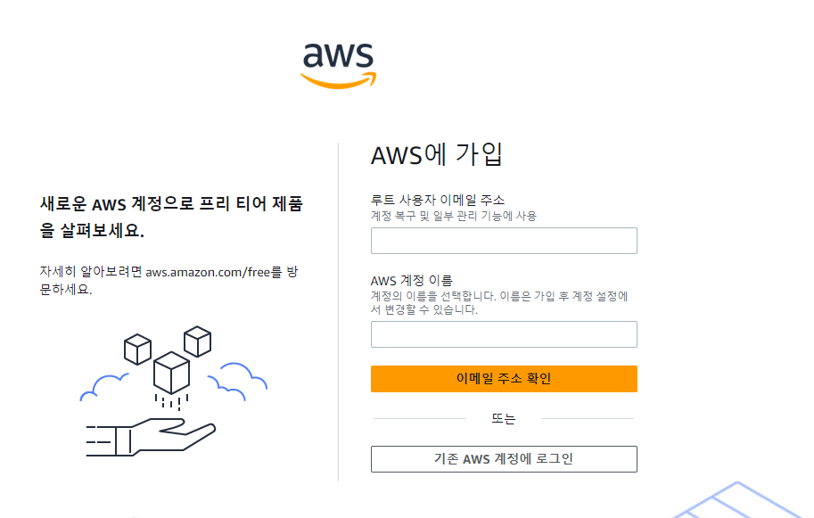
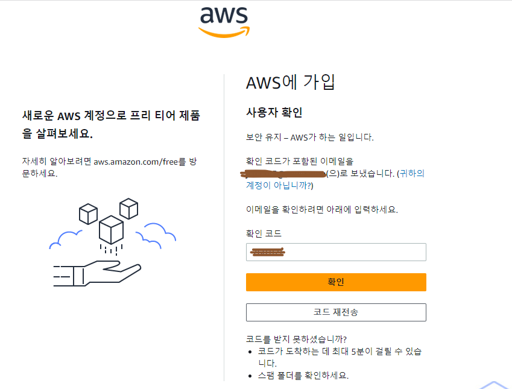
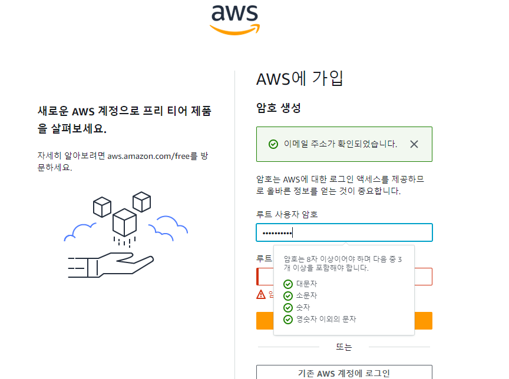
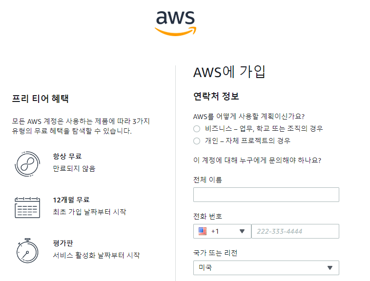
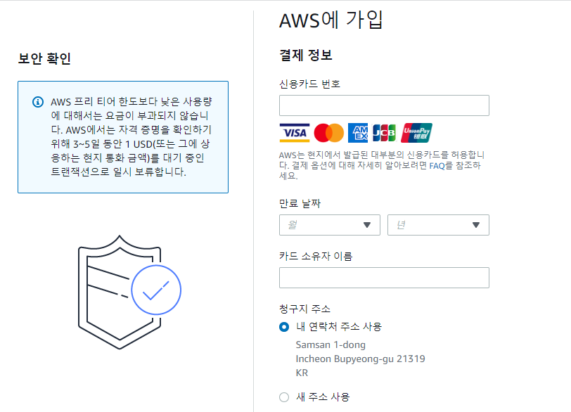
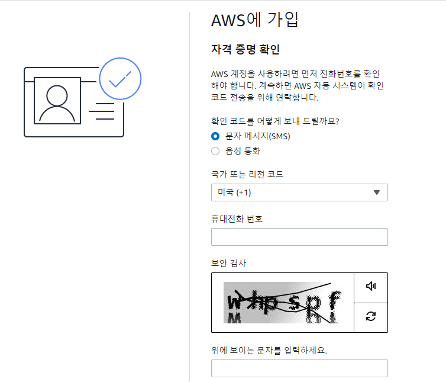
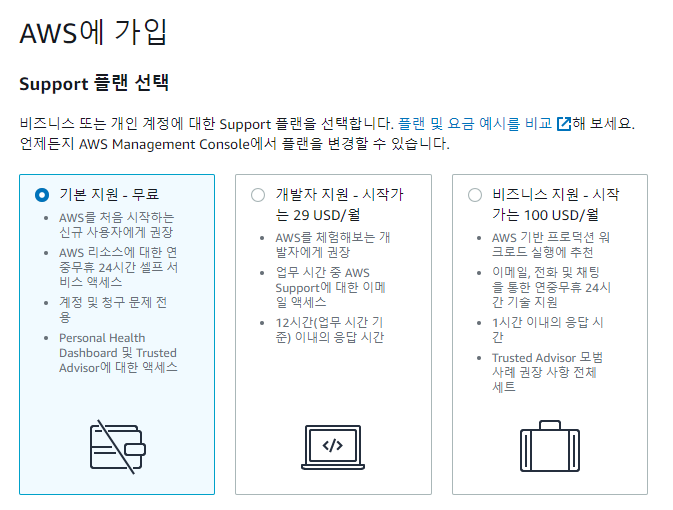
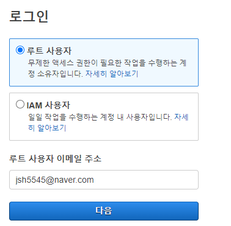
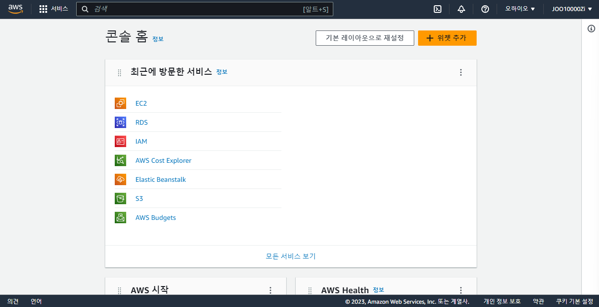

# AWS 회원가입

> 강의를 따라하기 위한 기초 준비 과정

1. AWS 사이트 회원가입 이동

   - 교육을 위한 가입이고 **무료**로 된 제품을 통해 강의를 들을 예정

     

   - 이메일을 주소 확인 후 보안 코드 입력
     

   - 보안이 맞도록 password 입력
     
   - 추자 정보 입력(추후 무료 티어로 진행 예정)
     
   - 결제를 위한 사전 정보 확인(카드 결제 자동 취소 처리 됨)
     
   - 연락처를 통한 본인 인증
     
   - 가입 플랜 선택시 비용이 부과 되지 않도록 **무료 선택**
     

#### 로그인

- 루트 사용자로 선택 후 로그린 진행

2. 로그인 후 메인 화면
   