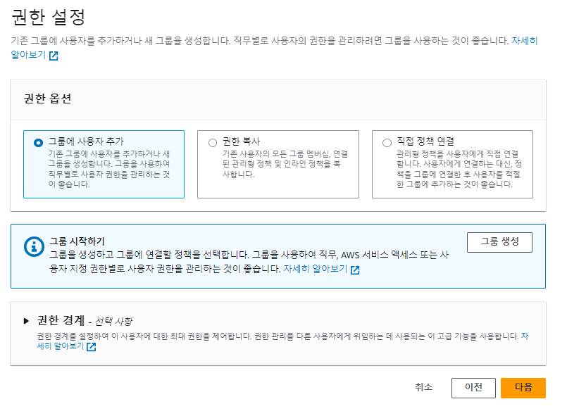

# IAM

## IAM 소개

> Users & Groups

- **IAM** = Identity and Access Management, **Global** service
- 루트 계정은 기본으로 생성되는 것, 계정을 생성 할때만 사용 하며 **사용하거나 공유 하지 않는다**
- **사용자를 생성**해서 서비스를 사용하며, 조직 내의 한 사람으로 다수일 경우 **그룹**으로 지정할 수 있다

- 그룹 지정
  - 그룹에는 사용자만 배치 할 수 있다.
  - 사용자는 복수의 그룹에 지정 할 수 있다
  - 그룹이 없는 사용자도 가능(*추천하지 않음*)

### Premissions

> AWS 계정을 사용하기 위해서 사용자와 그룹을 생성

- JSON 문서를 통해 사용자와 그룹에 권한을 부여 한다.
- 사용자와 그룹에 알맞은 정책을 허용하기 위한 기능
- AWS에서는 각 사용자와 그룹에 맞는 최소한의 권한을 부여하는 것을 추천
  - 사용가자 많은 서비스를 사용할 경우 큰 비용이 발생
  - 불필요한 권한에 따른 보안상의 문제를 야기 할 수 있음

## IAM 사용자 및 그룹 생성

- 루트 계정은 모든 권한을 가지고 있기 때문에 사용자를 생성하여 서비스를 사용 한다.

  

- AWS Management Console 엑세스 권한 제공 여부 테크하여 직접 IAM 사용자 생성여부 확인 후 진행
- Password는 자동 생성과, 직접 입력이 있음
  - 자동 생성 경우 진행 되는 단계에서 CSV 파일 필수 다운 해야함(사용자 정보 파일)
- 나머지 옵셥은 필요시 선택

- 그룹에 사용자를 지정하여 생성하는 것을 추천
  - 그룹이 없을 경우 그룹 생성을 바로 할 수 있다.

- 마지막 단계에서 .CSV파일 다운로드는 필수로 진행

#### 계정 별칭 변경

- 계정 별칭을 변경하여 사용 할 수 있음
  

- 별칭을 지정 하게 되면 별칭으로 변경된 **URL** 생성
- **URL**을 통해 로그인 페이지로 바로 접속하면 로그인 페이지로 연결 됨
  - AWS 로그인 화면 창에서 IAM 사용자 선택한 경우과 같은 페이지

#### 사용자 계정 로그인

